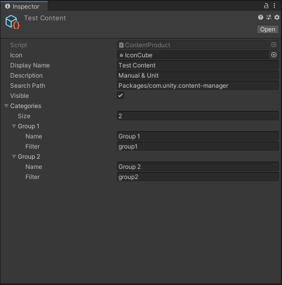
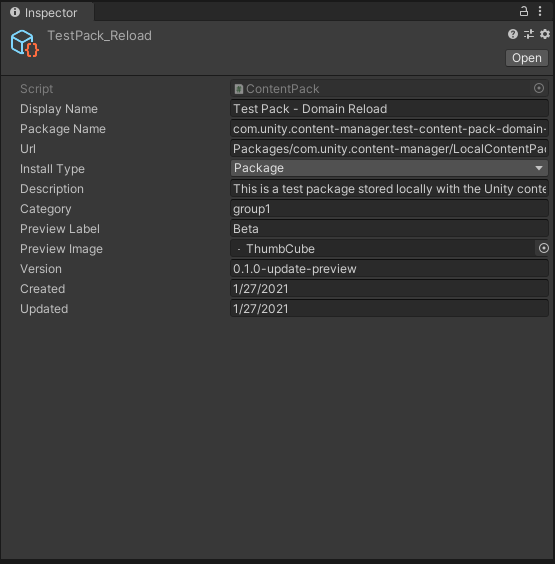

# Deploying your own content

The Unity Content Manager displays Content Packs found under the search path of the corresponding Content Product. A search path is a path to a folder within your Unity project (located under either `Assets` or `Packages`) that contains the Content Packs for the Content Product you selected.

## Creating a Content Product

To create a Content Product, follow these steps:

1. From Unity's main menu, go to **Create &gt; Content Manager &gt; Content Product**.
2. Add a 48 x 48 icon file.
3. Fill in the **Name** and **Description**.
4. Fill in the **Search Path**.  **Note:** For packages, your search path must start with `Packages/`.
5. Enable the **Visible** option so your Content Product appears in the Content Manager.
6. Fill in the **Categories** field if you expect to have a wide variety of content that will need to be filtered down

After you create a product, you can create content packs associated with it.

## Creating a Content Pack

To create a Content Pack, follow these steps:

1. From Unity's main menu, go to **Create &gt; Content Manager &gt; Content Pack.**
2. Fill in the following fields:

|**Field**|**Notes**|
|---|---|
|**Package Name**|Must match the package name in your content's `package.json` file.|
|**URL**|Can use any valid Package Manager scripting API reference. You can reference package names to link to the Unity registry directly.  Use `Packages/[Your package name]/~[Content Path]` to reference internal packages. See the test packs provided with the Unity Content Manager for examples of this.|
|**Install Type**|See [Using the Unity Content Manager](index.md#) for information about various install types.  **Note:** For direct imports, your content sample must be stored with a .unitypackage file. See the `TestPack_UnityPackage` sample provided with the Unity Content Manager for an example of this.|
|**Preview Label**|By default, all preview packages have the **Preview** label. You can override this with a different term that more accurately reflects the experimental nature of the package, but some label must be used.|
