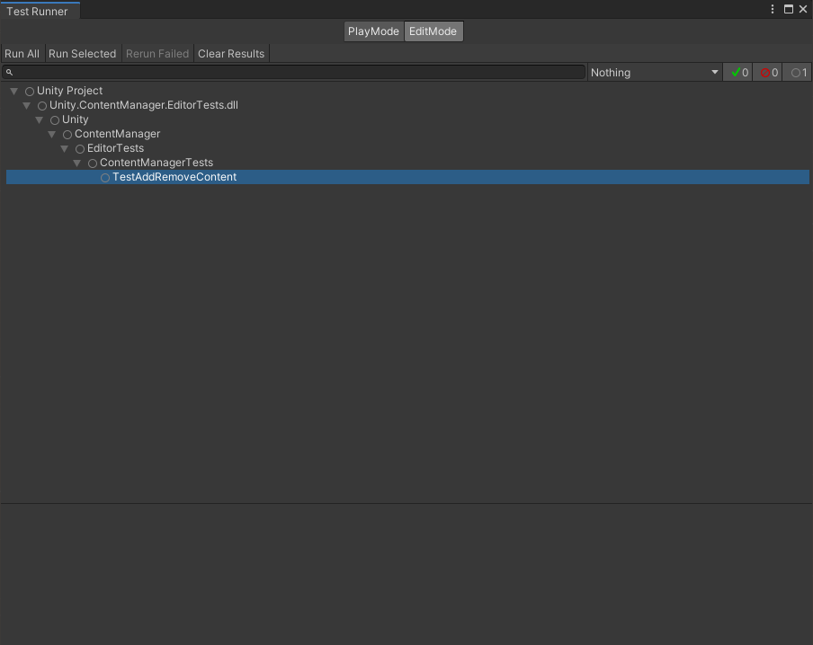
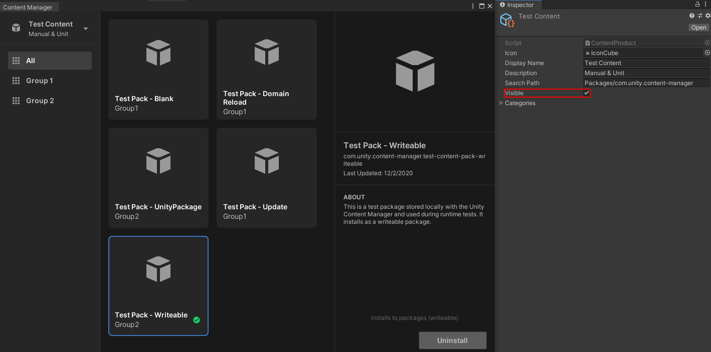

# Running the Unity Content Manager tests

The Unity Content Manager package provides a test suite for adding and removing Content Packs.

## Automated testing

To use the automated **TestAddRemoveContent** test, follow these steps:

1. From Unity's main menu, go to **Window &gt; General &gt; Test Runner**.
2. Access the **Unity &gt; ContentManager &gt; EditorTests &gt; ContentManagerTests** option.
3. Right-click the **TestAddRemoveContent** test and select **Run**.

## Manual testing

To test manual content installation, follow these steps:

1. Enable the **Test** product. Access the `Tests/ContentPacks/Test Content` folder in the Content Manager package inside the Project view, and enable the **Visible** option.
2. Open the Content Manager.
3. Install each test package. Queue up multiple installs at once.
4. Close the Content Manager.
5. Open the Content Manager.
6. Check the status of each product to make sure they are installed.
7. Uninstall each test package. Queue up multiple uninstalls at once.
8. Check the status of each product to make sure they are uninstalled.
