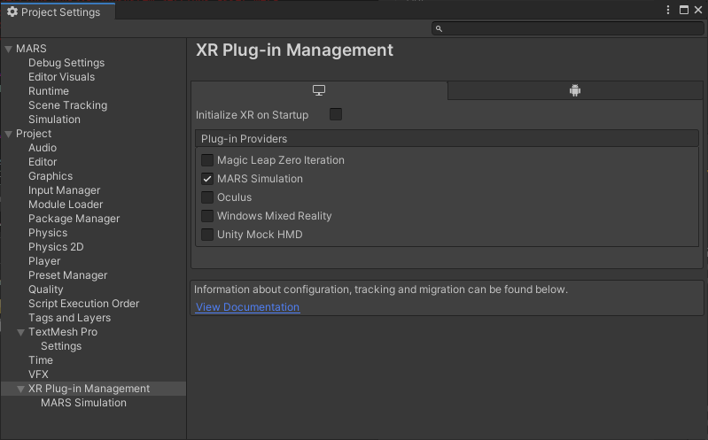

## MARS Simulation as an AR Subsystem

MARS's simulation system can provide the following data to AR Foundation, making it available to AR Foundation users in Play mode in the Editor:
- Camera pose
- Plane detection
- Depth point cloud
- Raycasting
- Face (eyes and poses, but no mesh)
- Image markers
- Light estimation

To activate this subsystem, follow these steps:

1. From Unity's main menu, go to **Edit &gt; Project Settings**.
2. Select the **XR Plug-in Management** section.
3. In the **PC, Mac & Linux Standalone settings** tab, select **MARS Simulation**.

Make sure no other providers are selected. When entering Play mode in the Editor, Unity will use the first selected provider in the list.

